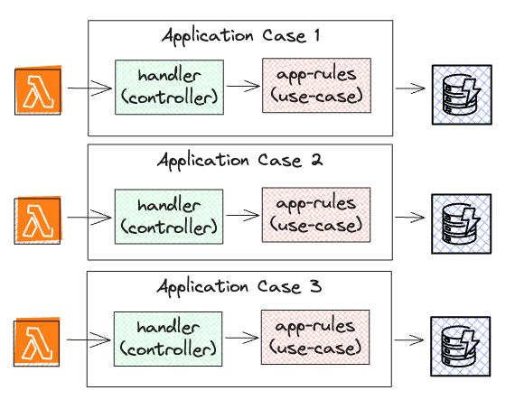

# File Structure / Skeleton

## TL;DR

A practical, scalable folder structure designed for both Minimum Viable Products (MVPs) and large-scale enterprise projects.

## Manifesto
- **Prioritize Critical Thinking:** Don't always rely on common sense; it might not be accurate.
- **Learn from Others:** Many people (some of them popular) have likely encountered similar challenges. Follow their lead.

## Explanation
- [Application cases](./doc/application-cases/README.md)
- [Domain](./doc/domain/README.md)
- [Repository](./doc/repository/README.md)

## Examples
- [Simple Serverless MVP](./examples/simple-mvp-serverless)  

- [MVP](./examples/simple-mvp)
- [Enterprise-project](./examples/enterprise-project)

## Motivation
Many existing folder conventions rely on traditional layered structures (package by layer), sometimes mistakenly labeled as "hexagonal" or "clean architecture." However, these architectures don't inherently dictate a horizontal (layered) approach.

The most effective way to highlight functionality is by organizing folders around application cases.

Let's move away from big service files and horizontal folder structures!

## Notable Quotes
> "A layered architecture doesn't scream anything about business domain"  
— Missing chapter, Clean architecture, Robert C Martin and Simon Brown  

> "As an application grows, each layer can get sufficiently complex on its own that you need to modularize further. When this happens it's usually not best to use presentation-domain-data as the higher level of modules. Often frameworks encourage you to have something like view-model-data as the top level namespaces; that's OK for smaller systems, but once any of these layers gets too big you should split your top level into domain oriented modules which are internally layered."  
— Presentation Domain Data Layering, Martin Fowler
 
> "The pattern has absolutely nothing to say about how you structure your application internally."  
— Hexagonal Architecture, Alistair Cockburn

## Compatibility

This structure has been successfully tested with:
- Serverless architectures using Lambda handlers
- NodeJs (ExpressJS, KoaJS, CLI)
- Domain-Driven Design (DDD)
- MVPs (without clean or hexagonal architecture)
- NestJS (avoiding excessive service files)
- Enterprise Projects (with clean architecture and DDD)

## Inspiration
- [DDD Forum by Khalil Stemmler](https://github.com/stemmlerjs/ddd-forum)
- [Clean architecture by Uncle Bob](https://web.archive.org/web/20140619161546/https://blog.cleancoder.com/uncle-bob/2012/08/13/the-clean-architecture.html)
- [Screaming Architecture by Uncle Bob](https://web.archive.org/web/20140702193834/http://blog.8thlight.com/uncle-bob/2011/09/30/Screaming-Architecture.html)

