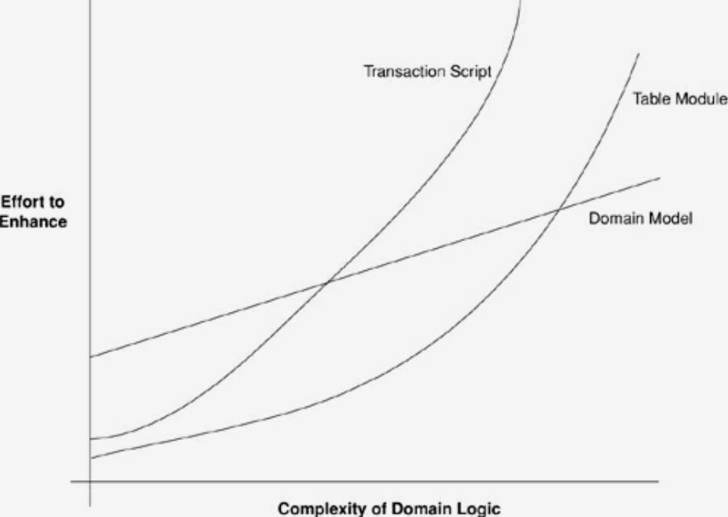

## Domain (Enterprise business rules)

A prefect place to DDD

**Optional** if you don't have a complex business (domain) rules (invariants) potencially you don't wanna need this layer.
For examples: normally the MVP only need a simple CRUD with application cases but not a domain.

So, when to use DDD?

> "It’s not an easy choice, and it very much depends on how complex your domain logic is."  
> — Martin, Fowler. Patterns of Enterprise Application Architecture (Addison-Wesley Signature Series (Fowler))

Is DDD Overrated?
> "you can only say DDD is overrated once you've achieved mastery over it. At this point, you can toss it aside. All the tactical patterns, techniques, approaches — you've already absorbed the wisdom. You're the boss. You don't need rules, cerimonies, other peoples' best practices. You set your own rules. Because you understand design, you know what's good, bad, too much design, too little, what the correct amount thereof is (see the Golden Mean) — you now have room to experiment and get creative."
> — Khalil Stemmler. https://khalilstemmler.com/blogs/domain-driven-design/is-ddd-overrated/

> "DDD is great, but it’s just one of many tools and techniques you should be aware of."
> — Stefan Tilkov. https://tilkov.com/post/2021/03/01/ddd-is-overrated/
